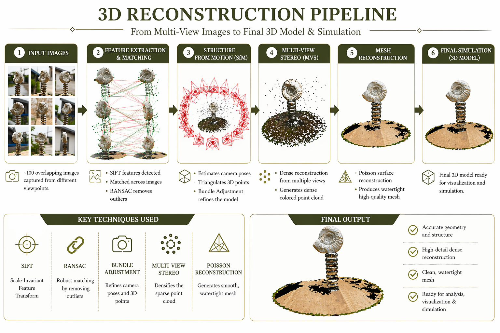
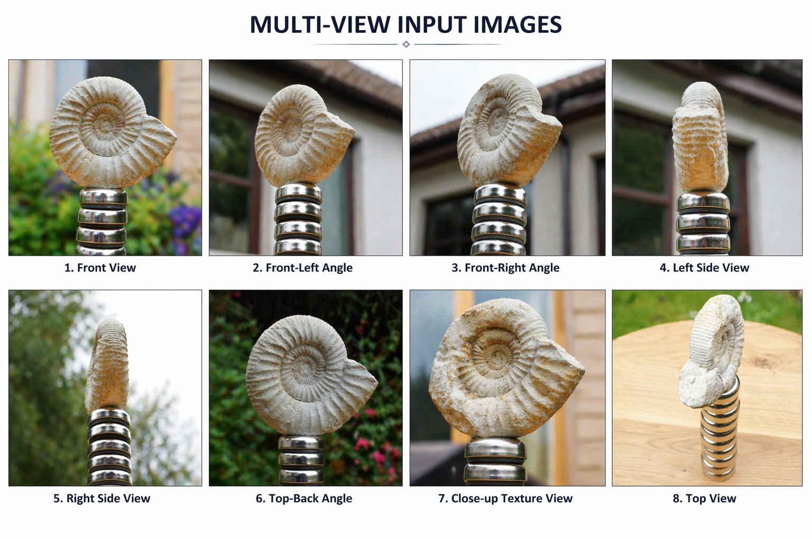
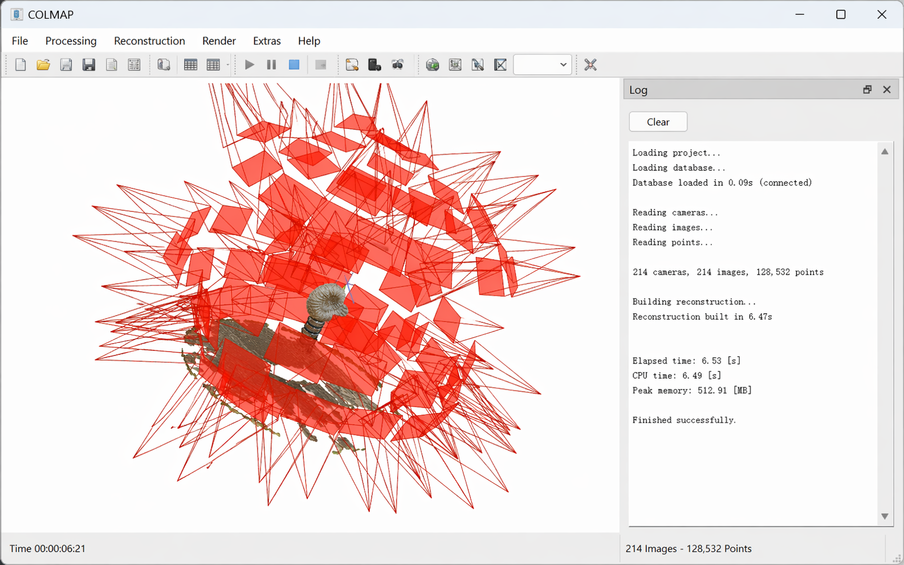
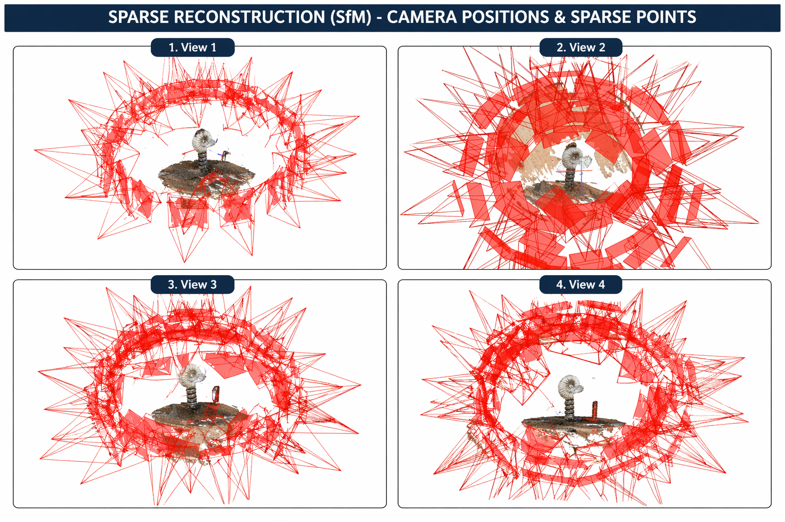
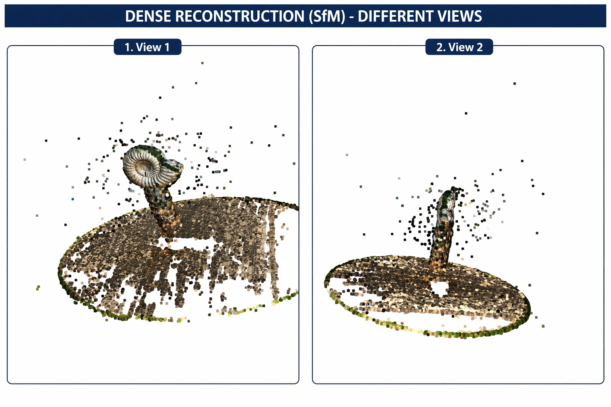
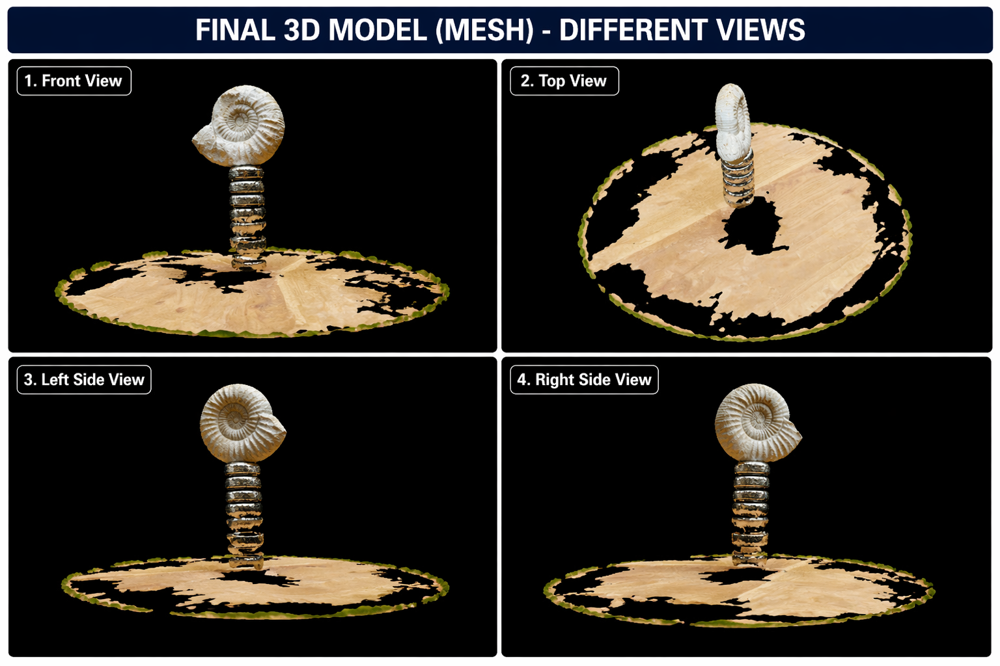

# 🚀 3D Reconstruction using COLMAP

> ⚡ Built a complete 3D reconstruction pipeline using multi-view geometry and COLMAP, converting 2D images into a high-quality 3D model.

---

## 🔍 Problem
Reconstruct a 3D model of a real-world object from multiple 2D images captured at different viewpoints.

---

## 🧠 Pipeline Overview

**Steps:**
1. Feature Extraction (SIFT)  
2. Feature Matching + RANSAC  
3. Structure from Motion (SfM)  
4. Dense Reconstruction (MVS)  
5. Mesh Generation (Poisson)  

---

## 📸 Input Images

- ~100 overlapping images  
- Captured from multiple angles  
- High overlap ensures better reconstruction  

---

## 🔗 Feature Matching & Camera Estimation

- SIFT features detected across images  
- Matched using nearest neighbors  
- RANSAC removes incorrect matches  
- Camera poses estimated  

---

## 📍 Sparse Reconstruction (SfM)

- Initial 3D structure generated  
- Camera positions visualized  
- Forms geometric backbone  

---

## 🧱 Dense Reconstruction (MVS)

- Dense point cloud generated  
- Captures fine details  
- Improves scene completeness  

---

## 🧊 Final Output (Mesh)

- Poisson Surface Reconstruction applied  
- Smooth, watertight 3D mesh generated  

---

## 📊 Results

| Metric | Value |
|------|------|
| Input Images | ~100 |
| Sparse Points | ~5K–10K |
| Dense Points | 100K+ |
| Time | ~5–10 minutes |
| Output | High visual accuracy |

---

## 🔬 Experiment: Effect of Number of Images

Due to hardware limitations, full dense reconstruction could not be executed for multiple image subsets. However, based on observed behavior and theoretical understanding:

### Observations:
- 30 images → insufficient overlap, incomplete reconstruction  
- 60 images → partial structure with missing details  
- 100 images → better coverage and accurate geometry  

### Insight:
Reconstruction quality strongly depends on:
- Image overlap  
- Number of viewpoints  
- Feature richness  

**Conclusion:** Increasing the number of images significantly improves reconstruction completeness and accuracy.

---

## 🔬 Key Observations

- More images → better reconstruction quality  
- Good lighting improves feature matching  
- Background noise introduces artifacts in dense stage  

---

## ⚠️ Challenges

- Sensitive to image overlap and quality  
- Noise in dense reconstruction  
- High computational cost  

---

## 🚀 Future Improvements

- Compare SIFT vs ORB for feature extraction  
- Apply noise filtering using Open3D  
- Optimize reconstruction time  

### 🏥 Medical Imaging Extension (Future Work)

- Extend this pipeline toward **3D reconstruction in medical imaging**
- Implement **3D volume reconstruction from CT scan (DICOM) slices**
- Explore reconstruction from multiple X-ray views (research direction)
- Investigate learning-based approaches such as NeRF for medical data  

---

## 🛠️ Tech Stack

- COLMAP  
- Python  
- Classical Computer Vision  

---

## 📌 Summary

End-to-end implementation of a **multi-view 3D reconstruction pipeline**, demonstrating how 2D images can be transformed into accurate 3D geometry, with future scope toward medical imaging applications.
